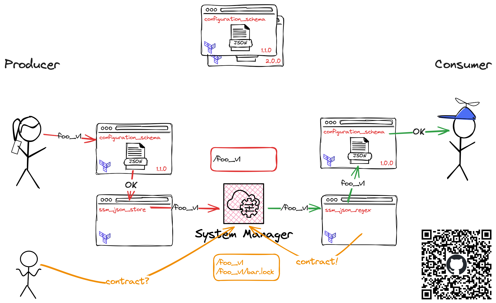
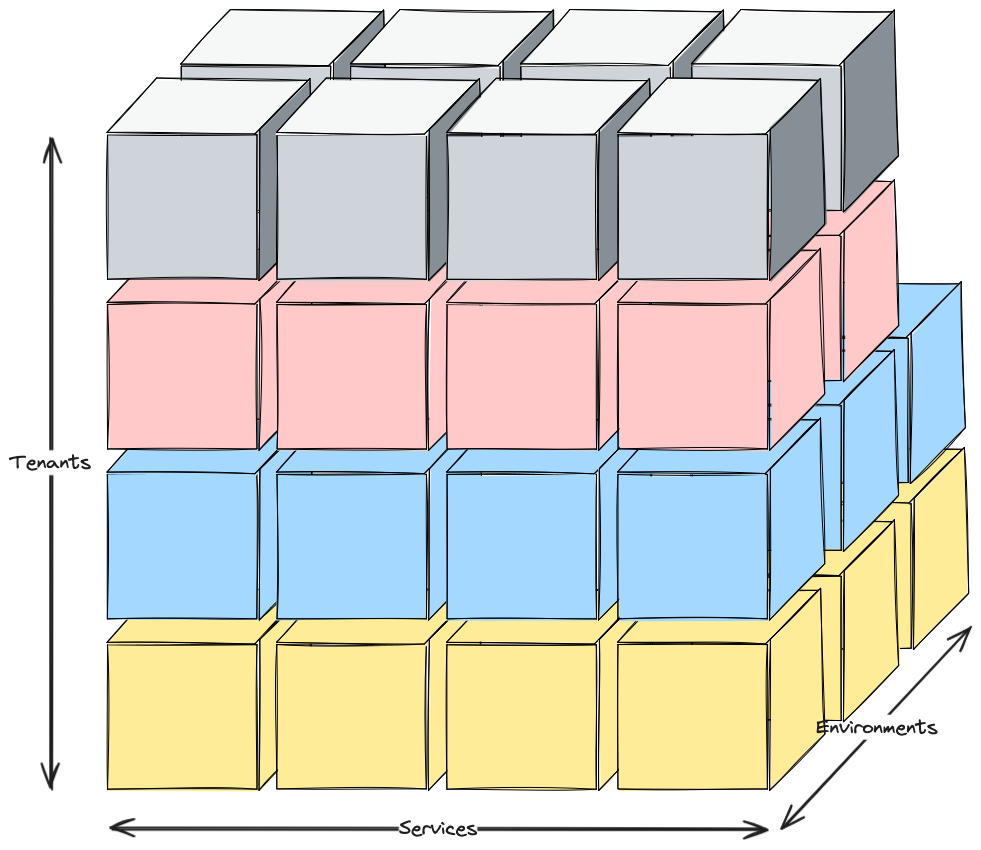
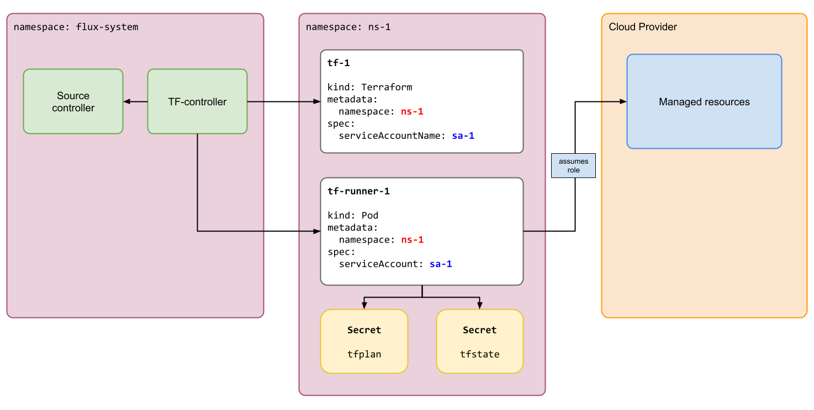
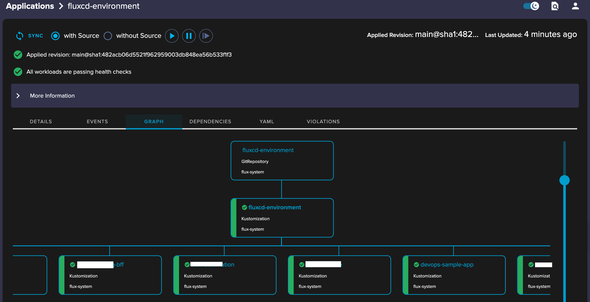
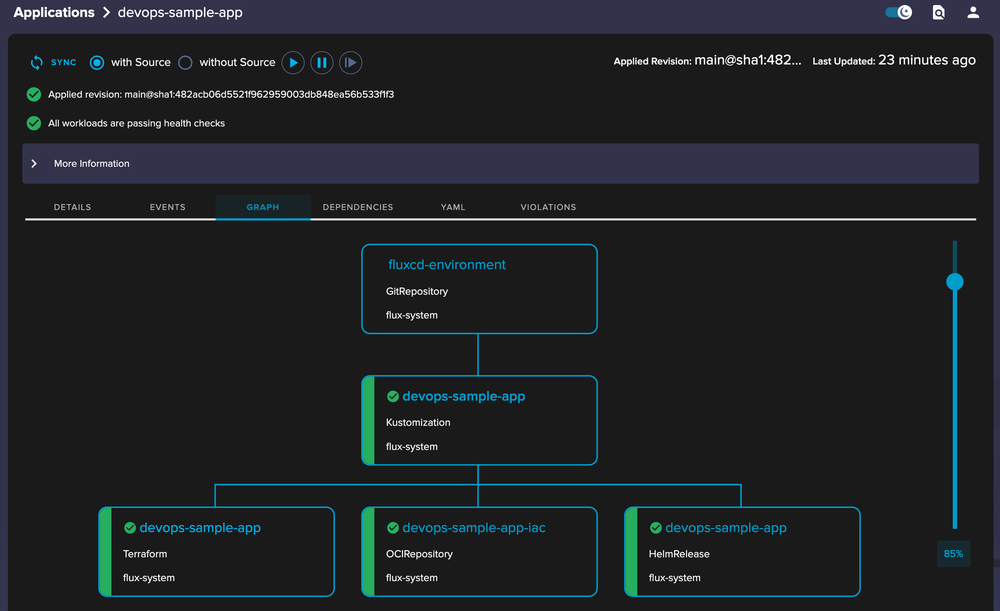
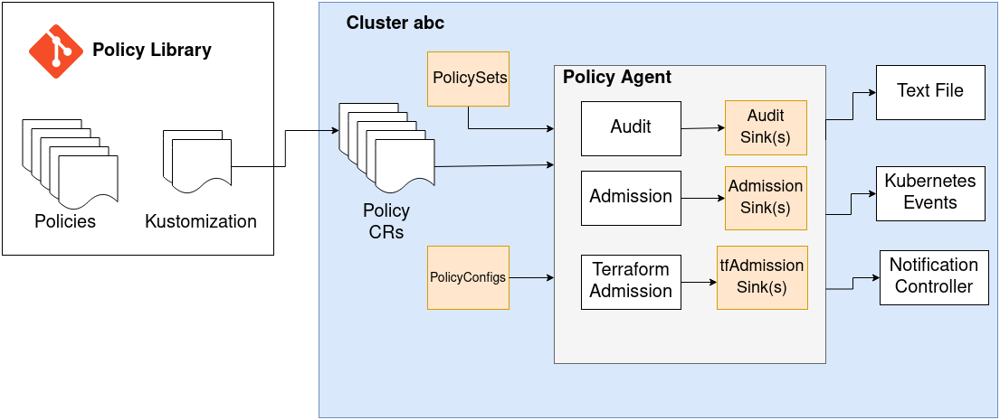
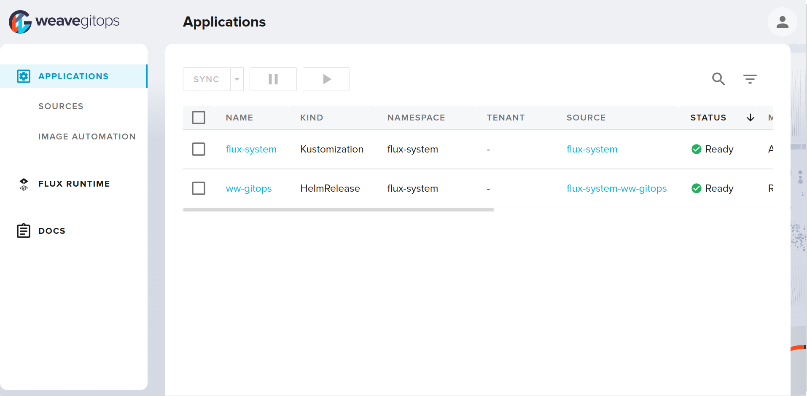
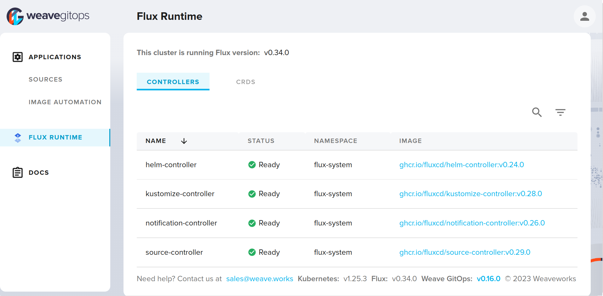
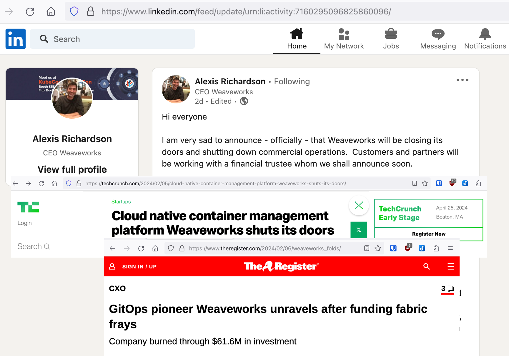

## Utilizing FluxCD, Weaveworks TF-Controller and boring-registry

> Why easy, when we can make it complicated?
> -- the unknown platform engineer

~~~~

### Usage/Navigation

- `n`, `p` - next, previous slide
- `o` - overview
- `f` - fullscreen
- `b` - black out the presentation
- `s` - speaker view
- :arrow_left: :arrow_right: - navigate on the top-level

# Daniel Ciaglia // _Consultant_

:::::: {.columns}
::: {.column}

- **Freelance** \
  _since 2022_
- **TIER Mobility SE** \
  _Director of Engineering_
- **kreuzwerker GmbH** \
  _Principal Consultant_
- **Bundesdruckerei GmbH** \
  _Senior Support Manager_
- _[**some more**]_
- SCUBA dive instructor
- **AWS User Group Berlin** \
  co-organiser

:::
::: {.column}

{style="width: 30vh;"}
{style="width: 30vh;"}

:::
::::::

# Today's menu

1. A typical Terraform stack evolution
2. Running Terraform in GitOps
3. Thoughts on the stack
4. Architectural Decision Records summary

# (1.1) Typical Terraform stack evolution[^1]

_Stack: Terraform root module[^2], tracked with 1 state file_

_Related_: Highly recommend talk "Terraform: from zero to madness" by [@Timur Bublik](https://sessionize.com/timur-bublik/)

## (1.1.1) in the beginning

:::::: {.columns}
::: {.column}

- you start your project
- put everything in 1 directory
- maybe split files by broader domains.

:::
::: {.column}

```text
.
├── databases.tf
├── vpc.tf
├── main.tf
├── outputs.tf
└── terraform.tf
```

:::
::::::

## (1.1.2) The staging/production split

:::::: {.columns}
::: {.column}

- oh well, you need a staging environment
- both environments are very much the same
- you refactor the code to be parameterised by variables
- you provide 2 `.tfvars` files

:::
::: {.column}

```text {data-line-numbers="3,4-5"}
.
├── production.tfvars
├── staging.tfvars
├── databases.tf
├── vpc.tf
├── variables.tf
├── main.tf
└── terraform.tf
```

:::
::::::

## (1.1.3) Code repetition - I need modules

:::::: {.columns}
::: {.column}

- you add more services and they need infra 
- the infra is similar
- you want to keep the code DRY[^3]
- you create a repo, codify best practices, tag them for versioning
- you pull in modules via git

:::
::: {.column}

```hcl
# select a specific tag
module "rds" {
  source = "github.com/example/rds?ref=v1.2.0"
}
```

:::
::::::

## (1.1.4) The great separation

:::::: {.columns}
::: {.column}

- as the stack grows, the environments differ
- you start separating the code in larger blocks
  - the base environment
  - the services
- the code is pulled in as modules
- the `services` module receives output of `base` as input
  eg. `vpc_id` or subnets
- `terraform apply plan` is run manually still

:::
::: {.column}

```text
.
├── environments
│   ├── production
│   │   ├── main.tf
│   │   ├── outputs.tf
│   │   └── variables.tf
│   └── staging
│       ├── main.tf
│       ├── outputs.tf
│       └── variables.tf
└── modules
    ├── base
    │   ├── main.tf
    │   ├── outputs.tf
    │   ├── variables.tf
    │   └── vpc.tf
    └── services
        ├── databases.tf
        ├── main.tf
        ├── outputs.tf
        └── variables.tf
```

:::
::::::

## (1.1.5) Fast forward

**:point_right: At this point in time I joined the project :point_left:**

:::::: {.columns}
::: {.column}

**The situation**

- as the stack grows further, the amount of resources does as well
- each run of `terraform plan -out plan` takes more and more time
- to review and apply changes for developers becomes a dayfilling job
- you start cheating by targeted apply
- you notice that the amount of files downloaded for each `terraform` step is enormous[^4]
- you notice that git tags can not be used for semantic versioning (`version`)

:::
::: {.column}

**Possible solutions**

- to address the versioning and data transfer issues - use a private Terraform module registry
- to address the runtime and ownership issue - split the stacks and let the teams handle them (DevOps style)

:::
::::::

## (1.2) The boring-registry 

- TIER Mobility developed their own "boring" Terraform registry without moving parts (hence the name)
  - Details to be found here: https://github.com/boring-registry/boring-registry/
  - The important feature for now is support for the [Module Registry Protocol](https://developer.hashicorp.com/terraform/internals/module-registry-protocol)
- **You provide** a S3 bucket, module code and package it in CD via
  `./boring-registry upload --type s3 (some more flags) ./your-module`
- **You'll get**
  semantic versioning

```hcl
module "rds" {
  source = "registry.example.com/acme/rds/aws"
  version = "~> 0.1"
}
```

## (1.3) Separating the service stacks

#### some Architectural Decisions

:::::: {.columns}
::: {.column}

**Don't**

- separate services along team borders[^5]
  :arrow_right: teams and responsibilities change, always  
- share states between services
  :arrow_right: there are secrets in there![^6]
  :arrow_right: read the docs of the [`terraform_remote_state`](https://developer.hashicorp.com/terraform/language/state/remote-state-data) data source!

:::
::: {.column}

**Do**

- Layer your stacks - account, network, clusters and services
- 1 Terraform stack per service
  - good for least privilige access
  - place the Terraform code into the service repo
- run the TF stacks in automation
- use an indirect way to share information between stacks[^7]

:::
::::::

## (1.3.1) Indirect information exchange

:::::: {.columns}
::: {.column}

- use structured data
  :arrow_right: ideally JSON for `jsondecode()` and `jsonencode()`
- use whatever storage you prefer
  :arrow_right: SSM Parameter Store or S3

:::
::: {.column}

Code for 3 Terraform modules will be provided

- `s3_json_store`
  CRUD JSON data on S3
- `ssm_json_store`
  CRUD JSON data on SSM Parameter store
- `ssm_json_regex`
  read SSM parameter with regex 

:::
::::::

## (1.3.2) Write data (base system)

```hcl {data-line-numbers="5-6, 8-20"}
module "ssm_service_data" {
  source  = "registry.example.com/foo/ssm_json_store/aws"
  version = "~> 1.0.2"

  path = "/configuration"
  name = "base"
  data = {
    domain           = local.domain_name
    environment      = local.environment
    environmentClass = local.environmentClass
    backup_plan      = local.backup_plan
    networking = {
      vpc_id              = module.base.vpc_default_id
      subnet_database_ids = module.base.subnet_private_database_ids
      subnet_k8s_ids      = module.base.subnet_private_k8s_ids
    }
    cluster = {
      name              = module.eks.cluster_name
      oidc_issuer_url   = module.eks.cluster_oidc_issuer_url
      oidc_provider_arn = module.eks.cluster_oidc_provider_arn
    }
  }
}
```

## (1.3.3) Write data (upstream)


```hcl {data-line-numbers="5-6, 8, 11-23"}
module "ssm_service_data" {
  source  = "registry.example.com/foo/ssm_json_store/aws"
  version = "~> 1.0.2"

  path = "/configuration"
  name = "upstream"
  data = {
    installed = true

    private = {}
    public = {
      sns = {
        "foo" = {
          "arn"  = module.sns_foo.arn
          "name" = module.sns_foo.name
        }
        sqs = {
          "bar" = {
            "arn"  = module.bar_queue.arn
            "name" = module.bar_queue.name
          }
        }
      }
    }
  }
}
```

## (1.3.4) Read data (downstream)

```hcl {data-line-numbers="6,10,14"}
module "ssm_data" {
  source  = "registry.example.com/foo/ssm_json_store/aws"
  version = "~> 0.1.0"

  path                 = "/configuration"
  include_filter_regex = "(base|upstream)"
}

module "sns_sqs_subscription_foo" {
  count   = try(module.ssm_data.values["upstream"]["installed"], false) ? 1 : 0
  source  = "registry.example.com/foo/sns_sqs_subscription/aws"
  version = "~> 0.1"

  sns_arn        = nonsensitive(module.ssm_data.values["upstream"]["public"]["sns"]["foo"]["arn"])
  
  message_retention_seconds = 1209600
  redrive_policy = jsonencode({
    deadLetterTargetArn = module.dead_foo[0].arn
    maxReceiveCount     = 5
  })
}
```

## (1.3.5) Downsides of strong decoupling

:::::: {.columns}
::: {.column}

- Data contracts between stacks
  - dependencies
  - versioning
- Dependencies of stacks
  - TF and Service code must be able to handle missing dependencies
  - reconciliation of TF stacks to check changed upstreams
  - eventually consistent

:::
::: {.column}

- Stack orchestration
  - state management should be centralised
  - stack execution should be in automation
- Permission management
  - for code changes (eg. `CODEOWNERS`)
  - for infrastructure changes
  - for accessing resources

:::
::::::

## (1.3.6) Soft data contract between stacks {background-color="#edfced"}



# What's "reasonable scale", btw?

:::::: {.columns}
::: {.column}

- we had 2 dimesions so far
  - number of TF stacks for `x`
  - number of environments for `y`
  - and a fixed number of tenants (`1`) for `z`
- let's expand the setup to multiple tenants
  - with this we'll get a real `z` dimension 

__`total stacks = stacks * environments * tenants`__

To give some numbers: my client [LYNQTECH](https://www.lynq.tech/) runs ~100 microservices in at least 2 environments per tenant
for 5+ tenants - north of 1000 stacks :wink:  

:::
::: {.column}



:::
::::::

# (2) Terraform in GitOps

## (2.1.1) FluxCD primer[^8]

:::::: {.columns}
::: {.column}

### What is GitOps?
> GitOps is an operational framework that takes DevOps best practices used for application development such as version control, collaboration, compliance, and CI/CD, and applies them to infrastructure automation.
> -- https://about.gitlab.com/topics/gitops/

- In our context - **pull vs. push principle**
  - You don't care in _which environment_ a stack runs in
  - They are ready for your stack and your code is pulled in (vs. pushed via a pipeline)

:::
::: {.column}


:::
::::::

## (2.1.2) Weaveworks TF Controller[^9][^18]



## (2.2.1) Structure of central FluxCD configuration

:::::: {.columns}
::: {.column}

- Each environment must be configurable individually
  - has its own entry point for FluxCD
  - this allows for configuration of deployed services
- For audit reasons, production environments must use fixed service versions, others can use semantic versioning  
- Flux applications must be DRY
  - do not c&p code
  - implication: no individual configuration of apps

:::
::: {.column}

- in the central Flux repo there are **NO** variables, parameters etc. pp.
  - we only document **the intent** to run a service
  - self-configuration happens inside of an environment
- Use of OCI-based registries for sources only
  - everything as a final artefact
  - `flux push artifact`[^12] is your friend

:::
::::::

## FluxCD as an App of Apps system

:::::: {.columns}
::: {.column}

```text {data-line-numbers="2-8,17-19"}
.
├── environments
│   ├── client-a
│   │   ├── prod
│   │   │   ├── services
│   │   │   │   ├ _versions.yaml
│   │   │   │   ├ foo.yaml
│   │   │   │   └ bar.yaml
│   │   │   └── system
│   │   └── stage
│   │       ├── services
│   │       └── system
│   ├── client-b
│ [...]
│
├── flux-apps
│  ├── service-stacks
│  │   ├── foo
│  │   ├── bar
│  │ [...]
│  │   └── baz
│  └── system
│    [...]
│      ├── vertical-pod-autoscaler
│      └── weaveworks-gitops
```

:::
::: {.column}

_from the perspective of an individual FluxCD installation_

- (0) - cloud and runtime is set up
  - provide data for stacks to become conscious  
- (1) - load environment
  - primary Flux app
  - references all secondary service Flux apps
  - includes the version tracking ConfigMap
- (2) - load service Flux apps
  - contains relevant manifests
  - eg. OCI Sources, Terraform, Kustomization
- (3) - apply individual service apps 

:::
::::::

---

### Primary Flux app



---

### Secondary Flux app



## (2.3.1) Post build variable substitution[^10]

:::::: {.columns}
::: {.column}

- FluxCD's unique possibility to replace variables in rendered manifests before apply 
- in FluxCD repo
  - environment specific `_versions.yaml` becomes `service-versions` ConfigMap
  - satisfies the "fixed versions" requirement
- In underlying IaC - basic environment information for a TF stack are written
  - `base` ConfigMap provides `client`, `environment` and other data
  - to form the path for Terraform state file

:::
::: {.column}

```yaml {data-line-numbers="6-9,16-20"}
apiVersion: v1
kind: ConfigMap
metadata:
  name: service-versions
data:
  version_foo: "2.5.0"
  version_foo_tf: "~ 0.1.0-0"
  version_vertical_pod_autoscaler: "~> 9.0.0"
  version_vertical_pod_autoscaler_tf: "~ 0.1.0"
---
apiVersion: v1
kind: ConfigMap
metadata:
  name: init
data:
  clientId: "tenant-a"
  domain: "stage.tenant-a.tld"
  environment: "stage"
  environmentClass: "non-prod"
  region: "eu-central-1"
```

:::
::::::

## (2.3.2) usage example

:::::: {.columns}
::: {.column}

```yaml {data-line-numbers="2,9"}
apiVersion: source.toolkit.fluxcd.io/v1beta2
kind: OCIRepository
metadata:
  name: foo-iac
spec:
  interval: 5m
  provider: aws
  ref:
    semver: "${version_foo_tf}"
  url: oci://xxx.dkr.ecr.eu-central-1.amazonaws.com/iac/foo
```

:::
::: {.column}

```yaml {data-line-numbers="2,9,11-12"}
apiVersion: infra.contrib.fluxcd.io/v1alpha2
kind: Terraform
metadata:
  name: foo
spec:
  backendConfig:
    customConfiguration: |
      backend "s3" {
        region         = "${region}"
        bucket         = "terraform-states"
        key            = "${clientId}/${environment}/stacks/foo.tfstate"
        role_arn       = "arn:aws:iam::xxx:role/tf-${clientId}-${environment}"
        dynamodb_table = "terraform-states-locks"
        encrypt        = true
      }
  sourceRef:
    kind: OCIRepository
    name: foo-iac
  vars: []
```

:::
::::::

## (2.4.1) Configuration Management

- (Terraform) code is agnostic of environments
- strict division of concerns between cloud and runtime environment
  - Helm/Kustomize - Runtime (Kubernetes)
  - Terraform - Cloud
- Each **Cloud** and **Runtime environment** allow a stack to become concious
  - Cloud: SSM data `base`; Runtime: ConfigMap `init`
  - :point_right: pull of configiguration vs. push
- per **code stack** - data are baked into artifact
    - terraform - single `configuration.tf`
    - kustomize - separate `overlay` directories
    - helm - separate `values.yaml`

## (2.4.2) Example

:::::: {.columns}
::: {.column}

```terraform
locals {
  service      = "foo"
  squad        = "bar"
  domain_name  = module.ssm_data.values["base"]["domain"]
  cluster_name = module.ssm_data.values["base"]["cluster"]["name"]
  client       = nonsensitive(module.ssm_data.values["base"]["clientId"])
  environment  = nonsensitive(module.ssm_data.values["base"]["environment"])
  env_class    = nonsensitive(module.ssm_data.values["base"]["environment_class"])

  configuration = {
    default = {
      k8s_namespace      = local.service
      k8s_sa_name        = local.service
      rds_instance_class = "db.t4g.medium"
    }
    client_a = {
      stage = {}
    }
    environment_classes = {
      non-prod  = {}
      prod = {
        rds_instance_class = "db.r6g.medium"
      }
    }
  }

  # choose the right configuration based on
  # client/environment/environment class or simply defaults
  selected_configuration = merge(
    local.configuration["default"],
    try(local.configuration[local.client][local.environment], {})
  )
}
```

:::
::: {.column}

```hcl
# get the central SSM config parameters
module "ssm_data" {
  source  = "registry.example.com/foo/ssm_full_json_store/aws"
  version = "0.3.1"

  path                 = var.config_map_base_path
  include_filter_regex = "(base|foo|bar)"
}

module "database" {
  source  = "registry.example.com/foo/RDS/aws"
  version = "3.5.0"

  identifier          = local.service
  squad               = local.squad
  rds_engine_version  = local.selected_configuration["rds_engine_version"]
  rds_instance_class  = local.selected_configuration["rds_instance_class"]
  client_id           = local.client
  environment         = local.environment
  vpc_id              = module.ssm_data.values["base"]["aws"]["vpc_id"]
  subnet_ids          = module.ssm_data.values["base"]["aws"]["subnet_public_ids"]
  # [...]
}
```

:::
::::::

## (2.4.3) Connecting Cloud and Runtime

:::::: {.columns}
::: {.column}

- remember: division of concerns - cloud and runtime
- Terraform stack writes structured data as JSON
- Runtime pulls in data via External Secrets Operator[^16]
- Reloader watches and upgrades Pods with their associated data

```hcl
module "ssm_service_data" {
  source  = "registry.example.com/foo/ssm_json_store/aws"
  version = "1.0.2"
  
  path = "/configuration"
  name = "foo"
  data = {
    installed = true
    private = {
      database = {
        database_name     = module.database.databas
        database_username = module.database.database_username
        endpoint          = module.database.endpoint
        reader_endpoint   = module.database.reader_endpoint
        port              = module.database.cluster_port
      }
    }
    public = {}
  }
}
```

:::
::: {.column}

```yaml
apiVersion: external-secrets.io/v1beta1
kind: ExternalSecret
metadata:
  name: foo-secrets-ssm
spec:
  target:
    name: foo-secrets-ssm
  data:
    # [...]
    - remoteRef:
        key: /configuration/foo
        property: private.database.database_username
      secretKey: DATABASE_USER
    - remoteRef:
        key: /configuration/foo
        property: private.database.endpoint
      secretKey: DATABASE_HOST
---
kind: Deployment
metadata:
  annotations:
    reloader.stakater.com/auto: "true"
```

:::
::::::

## (2.5) Specifics of TF-Controller

### (2.5.1) Traffic

:::::: {.columns}
::: {.column}

- each stack has its own `tf-runner` pod
  - **Decision**: no persistent pods between runs for security reasons (permissions of SA)
- Sizing example: `terraform-provider-aws_5.31.0_darwin_arm64.zip` = 84MB
- NAT costs _(AWS specific issue; GCP lowered egress costs to $0 recently)_
  - reconcile every 30'
  - `terraform init` for each execution
  - 100 stacks * 48 runs/day * ~100MB providers * $0,052/GB = **480GB/$24,96 day/environment**

:::
::: {.column}

- **boring-registry** to the rescue :tada:
  - [caching, pull-through proxy](https://github.com/boring-registry/boring-registry/#provider-network-mirror)
  - Provider Network Mirror Protocol
- provider stored and delivered as S3 objects
- :wink: use S3 VPC endpoints

:::
::::::

---

### `.terraformrc`

```hcl
credentials "my.terraform-registry.foo.bar" {
  token = "7H151553CUr3!" # we are 1337
}

provider_installation {
  network_mirror {
    url = "https://my.terraform-registry.foo.bar/v1/mirror/"
    include = ["*/*"]
  }
}
```

---

### (2.5.2) Kubernetes resources

:::::: {.columns}
::: {.column}

- each reconcile cycle triggers one `tf-runner` pod per stack
- each `tf-runner` pods consumes
  - ~800m CPU
  - ~150M Memory
- This would spawn a lot of machines at times
- using k8s limits based on `priorityClass`

:::
::: {.column}

```yaml {data-line-numbers="3, 5-6, 9, 14, 18, 20"}
apiVersion: scheduling.k8s.io/v1
description: used to limit the number of terraform runners
kind: PriorityClass
metadata:
  name: terraform
value: 0 # same priority as everybody else
---
apiVersion: v1
kind: ResourceQuota
metadata:
  name: terraform-runners
spec:
  hard:
    pods: "10"
  scopeSelector:
    matchExpressions:
    - operator: In
      scopeName: PriorityClass
      values:
      - terraform
```

:::
::::::

## (2.6) Weave Policy Engine[^17]

:::::: {.columns}
::: {.column}

- based on Rego and similar to Open Policy Agent
- **Goal**: auto approve Terraform changes
  - **Decision**: no destroy/recreate
  - **Decision**: no direct IAM resources (only via controlled modules)
- :warning: **not an easy task - talk of its own** 

:::
::: {.column}



:::
::::::

## (2.7) Weave GitOps UI[^11]

#### aka - the missing FluxCD UI



---



# (3.0) Is it production ready?

:::::: {.columns}
::: {.column}

- tf-controller is sometimes uncertain about the state
- slow development of tf-controller, ~~thank you HashiCorp~~
  - in principle ready for OpenTofu[^13]
  - the talk uses features from a pre-release[^14]
- observability is not ideal
  - eg. finding all Terraform Manifests, which have a pending plan

:::
::: {.column}

**Be honest, where are you in the project?**

- In the middle of cutting the large TF stacks
  - :point_right: very useful tool: [minamijoyo/tfmigrate](https://github.com/minamijoyo/tfmigrate)
- Automatic approvals are yet to come
- [Branch Planner](https://weaveworks.github.io/tf-controller/branch-planner/) needs to be implemented to enable full developer ownership
- after IaC migration, services move to FluxCD as well

:::
::::::

## (3.1) Why not the BACK stack[^15]?

:::::: {.columns}
::: {.column}

- **Backstage (B)**: A self-service portal to empower developers
- **Argo CD (A)**: A GitOps-based continuous delivery (CD) tool for streamlined software delivery.
- **Crossplane (C)**: A universal control plane simplifying self-service infrastructure provisioning through abstractions.
- **Kyverno (K)**: A Policy as Code (PaC) tool

:::
::: {.column}

- existent Terraform stack and knowledge did not justify re-write of IaC
- Crossplane is bound to 1 kubernetes cluster (state in etcd) where Terraform is bound to a state file 
- Introduction of Backstage was out of scope
- ArgoCD vs. FluxCD
  - ArgoCD's handling of Helm charts (templated and applied)
  - TF-Controller as part of FluxCD eco-system
  - ArgoCD has UI and concept of multi-cluster baked in
- Kyverno "runs as a dynamic admission controller"
  can not be used as a decision engine

:::
::::::

## (3.2) Downsides

- development and local testing of TF code is hard
  - possibly via Branch Planner
  - _only for Github sources_
- Terraform module registry - so batteries included for developers?
  yes, kind of, but
  - Terraform understanding needed
  - it is hard to grock the stack data exchange concept
  - we provide template repositories, use case documentation
- TF-Controller: (un)interruptable pods needed (for writing states)
- missing UI (for TF-Controller) and Monitoring APIs
- implicit data contracts between Terraform stacks


## (3.2.1) - An uncertain future {background-color="#edfced"}

{.r-stretch}

https://www.linkedin.com/feed/update/urn:li:activity:7160295096825860096/

## (3.3) Upsides

- all domains (code, kubernetes and cloud environment) follow the same pattern
  - same CI and CD
  - same artefact type (OCI)
  - similar release cycles
  - single entry point for Product Owners
- IaC runner can be replaced
  - TF-Controller is just **a** controlled terraform executor
  - migration to eg. Spacelift.io or others possible
  - break-the-glas scenario supported (manual stack execution)
- Terraform/OpenTofu eco-system can be reused
  - providers
  - knowledge and modules

# (3.4) Thanksides

- [LYNQTECH GmbH](https://www.lynq.tech/) for granting permission to share information and code
  - :wink: LYNQTECH is hiring
    https://www.lynq.tech/jobs/
- All colleagues who were and are part of this journey
- The FluxCD Community and WeaveWorks for their software

{width=20%}
{width=20%}
{width=20%}

# (4.0) Architectural decisions

:::::: {.columns}
::: {.column}

**General FluxCD**

- Each tenant environment must be configurable individually
  - For audit reasons, production envs must use fixed service versions
- Applications, in the central repo, must be DRY. No inidividual stacks.
- Use of OCI-based registries for sources only (exception: external Helm)
- Code is agnostic of environments and is not parameterised
  - Each **cloud (AWS)** and **runtime (Kubernetes) environment** allows a stack to become concious
  - kustomize style data baked into artifact
- Secrets synchronised via External-Secret Operator
- Kubernetes cluster should be treated as cattle

:::
::: {.column}

**TF-Controller**

- No vendor lock-in; re-usability of eco-system strong plus
  - Terraform providers
  - Terraform OSS modules
- No persistent pods between runs
- Aim for Auto approval for Terraform changes
  - no destroy/recreate
  - no direct IAM resources (only via controlled modules)
  - only approved top-level module sources

:::
::::::

# Sources + Links

1. FluxCD documentation - https://fluxcd.io/flux/components/
2. Weave GitOps // Terraform Controller documentation - https://weaveworks.github.io/tf-controller/
3. Weave GitOps // The Policy Ecosystem - https://docs.gitops.weave.works/docs/policy/getting-started/

[^1]: your experience might be different :smile:

[^2]: https://developer.hashicorp.com/terraform/language/files#the-root-module

[^3]: https://en.wikipedia.org/wiki/Don%27t_repeat_yourself

[^4]: HashiTalks DACH 2020 - [Opinionated terraform modules and a registry](https://www.sigterm.de/2020/12/03/hashitalks-dach/)

[^5]: [How TIER switched paradigms - from team- to service-centric](https://tier.engineering/How-TIER-switched-paradigms-from-team-to-service-centric-Part-1)

[^6]: [Sensitive Data in State](https://developer.hashicorp.com/terraform/language/state/sensitive-data)

[^7]: [TF-CIX as an approach to share information between terraform stacks](https://www.sigterm.de/2021/09/02/tier-infra-part-3/)

[^8]: https://fluxcd.io/flux/components/

[^9]: https://github.com/weaveworks/tf-controller

[^10]: https://fluxcd.io/flux/components/kustomize/kustomizations/#post-build-variable-substitution/

[^11]: https://github.com/weaveworks/weave-gitops and https://docs.gitops.weave.works/

[^12]: https://fluxcd.io/flux/cmd/flux\_push\_artifact/

[^13]: https://www.opentofu.org/

[^14]: https://github.com/weaveworks/tf-controller/releases/tag/v0.16.0-rc.3

[^15]: Introducing the BACK Stack! - https://www.youtube.com/watch?v=SMlR12uwMLs

[^16]: [https://external-secrets.io/](https://external-secrets.io/latest/), [stakater/Reloader](https://github.com/stakater/Reloader)

[^17]: [Weave Policy Engine](https://docs.gitops.weave.works/docs/policy/intro/), [Integrate TF Controller with Flux Receivers and Alerts](https://weaveworks.github.io/tf-controller/use-tf-controller/flux-receiver-and-alert/), [Open Policy Agent](https://www.openpolicyagent.org/)

[^18]: _**Please note**: As the tf-runner ServiceAccount is usually very powerful, do not run it in an accessible namespace!_